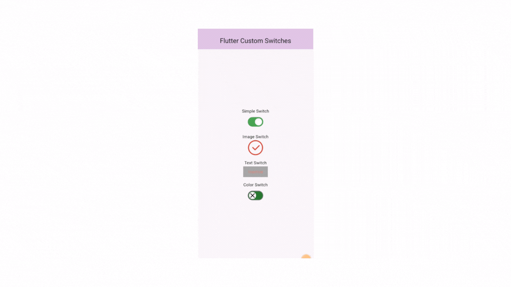

# [Flutter Material PM Switch](https://pub.dev/packages/pm_switch)

Custom switch Library for Flutter

[](https://pub.dev/packages/pm_switch)


A Flutter Switch widget allows users to toggle between two states, like "on" and "off," typically triggered by a tap gesture.

## Supported Platforms

> - Android
> - IOS
>


## How to Use

```yaml
# add this line to your dependencies
pm_switch: ^1.0.0
```

```dart
import 'package:pm_switch/pm_switch.dart';
```

## Flutter PM Switch (Android & iOS)

```dart
import 'package:flutter/material.dart';
import 'package:pm_switch/pm_switch.dart';

void main() {
  runApp(MyApp());
}

import 'package:flutter/material.dart';
import 'package:pm_switch/pm_switch.dart';

void main() {
  runApp(const MyApp());
}

class MyApp extends StatefulWidget {
  const MyApp({super.key});

  @override
  _MyAppState createState() => _MyAppState();
}

class _MyAppState extends State<MyApp> {
  bool isSimpleSwitched = false;
  bool isImageSwitched = false;
  bool isTextSwitched = false;
  bool isColorSwitched = false;

  @override
  Widget build(BuildContext context) {
    return MaterialApp(
      debugShowCheckedModeBanner: false,
      home: Scaffold(
        appBar: AppBar(
          title: const Center(child: Text('Flutter Custom Switches')),
          backgroundColor: Colors.purple[100],
        ),
        body: Padding(
          padding: const EdgeInsets.all(16.0),
          child: Center(
            child: Column(
              mainAxisAlignment: MainAxisAlignment.center,
              children: [
                const Text('Simple Switch'),
                const SizedBox(
                  height: 2,
                ),
                PMSimpleSwitch(
                  isSwitched: isSimpleSwitched,
                  onChanged: (value) {
                    setState(() {
                      isSimpleSwitched = value;
                    });
                  },
                  activeTrackColor: Colors.green,
                  inactiveThumbColor: Colors.grey,
                ),
                const SizedBox(height: 16),
                const Text('Image Switch'),
                const SizedBox(
                  height: 2,
                ),
                ImageSwitch(
                  isSwitched: isImageSwitched,
                  onChanged: (value) {
                    setState(() {
                      isImageSwitched = value;
                    });
                  },
                  activeImage: 'assets/selected.png',
                  inactiveImage: 'assets/close.png',
                ),
                const SizedBox(height: 16),
                const Text('Text Switch'),
                const SizedBox(
                  height: 2,
                ),
                TextSwitch(
                  isSwitched: isTextSwitched,
                  onChanged: (value) {
                    setState(() {
                      isTextSwitched = value;
                    });
                  },
                  activeText: 'Active',
                  inactiveText: 'Inactive',
                  activeColor: Colors.purple[300],
                  inactiveTrackColor: Colors.grey,
                  inactiveThumbColor: Colors.white,
                  activeTrackColor: Colors.red[300],
                ),
                const SizedBox(height: 16),
                const Text('Color Switch'),
                SizedBox(
                  height: 2,
                ),
                PMCustomColorSwitch(
                  isSwitched: isColorSwitched,
                  onChanged: (value) {
                    setState(() {
                      isColorSwitched = value;
                    });
                  },
                  activeThumbImage: const AssetImage("assets/active.png"),
                  activeTrackColor: Colors.green[800],
                  inactiveThumbColor: Colors.white,
                  inactiveTrackColor: Colors.green[800],
                  inactiveThumbImage: const AssetImage("assets/inactive.png"),
                ),
              ],
            ),
          ),
        ),
      ),
    );
  }
}

```

| Property             | Description                                                                  | Default                     |
|----------------------|------------------------------------------------------------------------------|-----------------------------|
| value                | The state of the switch (required)                                           | false                       |
| onChanged            | Called when the user toggles the switch (required)                            |                             |
| activeColor          | The color to use when this switch is on                                       |                             |
| activeTrackColor     | The color to use for the switch's track when the switch is on                 |                             |
| inactiveThumbColor   | The color to use for the thumb when the switch is off                         |                             |
| inactiveTrackColor   | The color to use for the switch's track when the switch is off                |                             |
| activeThumbImage     | An image to use for the switch's thumb when the switch is on                  |                             |
| onActiveThumbImageError | Called when there is an error loading the activeThumbImage                  |                             |
| inactiveThumbImage   | An image to use for the switch's thumb when the switch is off                 |                             |
| onInactiveThumbImageError | Called when there is an error loading the inactiveThumbImage               |                             |
| thumbColor           | The color to use for the thumb regardless of the switch's state               |                             |
| trackColor           | The color to use for the track regardless of the switch's state               |                             |
| trackOutlineColor    | The color to use for the track's outline                                      |                             |
| trackOutlineWidth    | The width of the track's outline                                              |                             |
| thumbIcon            | An icon to display instead of a thumb                                         |                             |
| materialTapTargetSize | Configures the minimum size of the tap target                                |                             |
| dragStartBehavior    | Determines the way that drag start behavior is handled                        | DragStartBehavior.start    |
| mouseCursor          | The cursor for a mouse pointer when it enters or is hovering over the widget |                             |
| focusColor           | The color to use for filling the area around the switch's thumb when the switch is focused |                     |
| hoverColor           | The color to use for filling the area around the switch's thumb when the switch is hovered over |                |
| overlayColor         | The color to use for the splash effect that fills the area around the switch's thumb when the switch is pressed | |
| splashRadius         | The radius of the splash effect when the switch is pressed                    |                             |
| focusNode            | An object that manages the focus state for this widget                        |                             |
| onFocusChange        | Called when the focus state of the switch changes                             |                             |
| autofocus            | Whether this switch should focus itself if it's initially focusable           | false                       |


Required properties

| Property   | Description                                       |
|------------|---------------------------------------------------|
| value      | The state of the switch (required)                |
| onChanged  | Called when the user toggles the switch (required) |


## Preview Example (BuildContext)




## Author
PM Coding

## Contributing
Contributions, issues, and feature requests are welcome!

## Show your Support
Give a star if this project helped you. 
